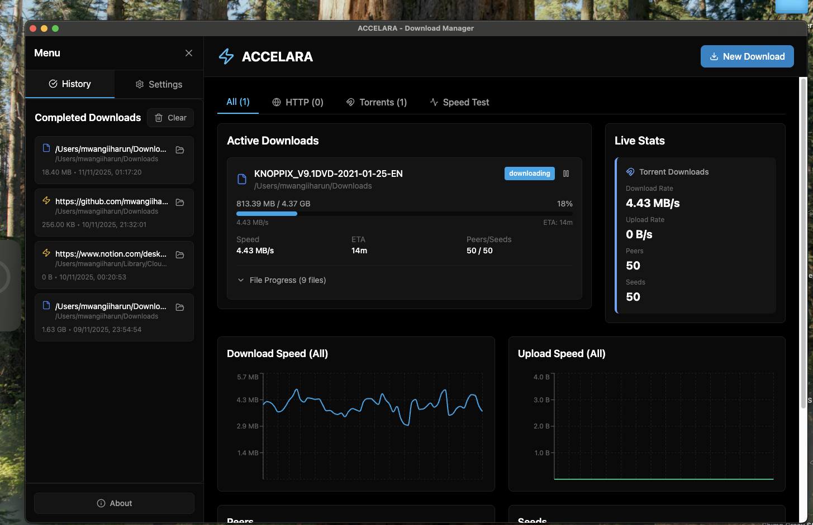

<div align="center">

# 🚀⚡🔥 ACCELARA 🔥⚡🚀

```
╔═══════════════════════════════════════════════════════════╗
║                                                           ║
║    █████╗  ██████╗ ███████╗██╗      █████╗ ██████╗  █████╗ ║
║   ██╔══██╗██╔════╝██╔════╝██║     ██╔══██╗██╔══██╗██╔══██╗║
║   ███████║██║     █████╗  ██║     ███████║██████╔╝███████║║
║   ██╔══██║██║     ██╔══╝  ██║     ██╔══██║██╔══██╗██╔══██║║
║   ██║  ██║╚██████╗███████╗███████╗██║  ██║██║  ██║██║  ██║║
║   ╚═╝  ╚═╝ ╚═════╝╚══════╝╚══════╝╚═╝  ╚═╝╚═╝  ╚═╝╚═╝  ╚═╝║
║                                                           ║
║  🎯 Unified HTTP + BitTorrent CLI Download Manager 🎯     ║
║                                                           ║
╚═══════════════════════════════════════════════════════════╝
```

**⚡ Accelerate your downloads with style! (And by "style" I mean "actually works") ⚡**

</div>

## What Even Is This?


So you're tired of `wget` being boring, `curl` being cryptic, and your browser download manager being... well, a browser download manager that takes 15 seconds too long. Welcome to **ACCELARA** - the download manager that actually gives a damn about your bandwidth and your time.

This is a **unified command-line download manager** that handles both HTTP/HTTPS and BitTorrent downloads. It's like having a Swiss Army knife, but instead of a corkscrew you'll never use, you get segmented downloads and resume support that actually works.

Oh, and I also built a **fancy Electron GUI** because apparently typing commands is too hard for some people. (I'm looking at you, future self who got tired of the terminal after building the CLI version.)

---

## Screenshot

<div align="center">



*The ACCELARA GUI showing active downloads, real-time stats, speed graphs, and download history*

</div>

---

## Features

### HTTP/HTTPS Downloads - The Boring But Necessary Part

- ✅ **Segmented Downloads** - Download files in parallel chunks. Waiting is for peasants.
- ✅ **Resume Support** - Your internet died? No problem. It'll pick up where you left off like nothing happened.
- ✅ **Rate Limiting** - Your ISP probably has a data cap and you're too lazy to check. I've got you covered.
- ✅ **SHA256 Verification** - Verify your downloads aren't corrupted or tampered with. Paranoia is healthy.
- ✅ **Custom Headers** - Add authentication headers. APIs are needy like that.
- ✅ **Proxy Support** - Download through proxies when you need to pretend you're in a different country.
- ✅ **Configurable Timeouts** - Set timeouts so you don't wait forever for that slow server.
- ✅ **Retry Logic** - Automatic retries with exponential backoff. The first failure wasn't enough.

### BitTorrent Downloads - The Fun Part

- ✅ **Magnet Links** - Typing `magnet:?xt=urn:btih:` is totally normal. Trust me.
- ✅ **Torrent Files** - Support for local and remote `.torrent` files. The old school way.
- ✅ **Sequential Mode** - Download files in order for streaming. Who has time to wait?
- ✅ **Rate Limits** - Set separate upload and download limits. Be a good citizen, share your bandwidth.
- ✅ **DHT Support** - Distributed hash table for peer discovery. It's basically magic.
- ✅ **Progress Tracking** - Real-time progress with peer count and speeds. Watch those numbers go up!

### General Features - The "I Thought of Everything" Part

- ✅ **Cross-Platform** - Works on Linux, macOS, and Windows. Yes, even Windows.
- ✅ **Progress Bars** - Visual progress indicators. Watching text scroll is so 1990s.
- ✅ **Quiet Mode** - Suppress output for scripting. Automation is the future.
- ✅ **Graceful Interruption** - CTRL+C support with resume capability. Accidents happen.

---

## Installation (The Part Where You Actually Do Something)

### Prerequisites (Things You Should Already Have)

- Python 3.7+ (if you don't have this, what are you even doing?)
- pip (comes with Python, so you're good)

### CLI Installation (The Simple Way)

```bash
# Set up virtual environment (global installs are for masochists)
python3 -m venv .venv
source .venv/bin/activate  # or .venv\Scripts\activate on Windows

# Install dependencies (this might take a while, go get coffee)
pip install -r requirements.txt
```

**Note:** For BitTorrent support, you'll need `libtorrent`:
- **Linux/macOS**: `pip install libtorrent` - easy peasy
- **Windows**: `pip install python-libtorrent` - Windows has to be different

The script will automatically detect which library is available. If it doesn't find one, you'll get a helpful error message that's probably more helpful than this README.

### Make It Executable (Optional, But Recommended)

```bash
chmod +x clidm.py
```

Now you can run it like a real program:
```bash
./clidm.py https://example.com/file.zip
```

---

## Electron GUI Installation (For People Who Don't Like Terminals)

### Prerequisites

- Node.js 20+ and npm - I needed more dependencies (Vite requires 20.19+ or 22.12+)
- Go 1.21+ (for the backend)
- Make (optional, but recommended)

### Setup 

1. **Build the Go backend**:
   ```bash
   make build-api
   # Or manually: go build -o bin/api-wrapper ./cmd/api-wrapper
   ```

2. **Install Node.js dependencies** (this will download half the internet):
   ```bash
   npm install
   ```

3. **Run in development mode** :
   ```bash
   npm run dev
   ```

   This will:
   - Start Vite dev server (http://localhost:5173)
   - Launch Electron window - clicking is easier than typing
   - Enable hot reload - watch your changes break in real-time!

4. **Build for production**:
   ```bash
   make build-api      # Build Go backend
   npm run build:react # Build React app
   npm run build       # Build Electron app (with electron-builder)
   ```

---

## Building for Distribution 

Good news: I've made it (relatively) easy. Bad news: cross-platform builds require the actual platforms. Who knew?

### The One-Command Wonder (If You're Lazy)

Just run this and pray:

```bash
npm run build
```

This will:
- Build the Go backend 
- Build the React frontend 
- Package everything into a beautiful Electron app

**But wait!** This only builds for your current platform. Want to build for all platforms? Read on, you ambitious soul.

---

### Building for macOS (The "I Have a Mac" Edition)

You're on macOS? Lucky you. This is the easiest one:

```bash
# Build for your current architecture (Intel or Apple Silicon)
npm run build

# Or be fancy and build for both architectures
npm run build -- --mac --x64 --arm64
```

**Output:** A beautiful `.dmg` file in `release/mac/` that you can double-click to install. It's like magic, but with more disk space.

**What you get:**
- `ACCELARA.dmg` - The installer that makes macOS users feel fancy
- `ACCELARA.app` - The actual app (because `.app` bundles are macOS's way of saying "I'm organized")

**Pro tip:** If you want to code-sign it (so macOS doesn't throw scary warnings), you'll need an Apple Developer account. But honestly, who has $99/year for that? Just tell users to right-click and "Open Anyway" like the rest of us rebels.

---

### Building for Windows (The "I Don't Have Windows But Need to Build For It" Problem)

Ah, Windows. The platform that requires... Windows. Here's the thing: you can't build Windows installers on macOS or Linux. It's a Windows thing. They're special like that.

**Option 1: Actually Use Windows (The Obvious Solution)**

If you have access to a Windows machine (or VM, or WSL2, or a friend's laptop):

```bash
# On Windows (PowerShell or CMD)
npm run build
```

This creates:
- `ACCELARA Setup.exe` - An NSIS installer that Windows users will recognize
- Located in `release/win-unpacked/` - The unpacked version (for testing)

**Option 2: Use GitHub Actions **

Create `.github/workflows/build.yml`:

```yaml
name: Build Windows App
on: [push]
jobs:
  build:
    runs-on: windows-latest
    steps:
      - uses: actions/checkout@v3
      - uses: actions/setup-go@v4
        with:
          go-version: '1.21'
      - uses: actions/setup-node@v3
        with:
          node-version: '20'
      - run: go mod download
      - run: npm install
      - run: npm run build
      - uses: actions/upload-artifact@v3
        with:
          name: windows-build
          path: release/*
```

Then push to GitHub and let Microsoft's servers do the work. It's like having a Windows machine, but free and in the cloud. Magic.

**Option 3: Use Wine on Linux (The "I'm a Masochist" Solution)**

```bash
# Install Wine (because why not?)
sudo apt install wine  # or your distro's equivalent

# Set up Windows environment
export WINEPREFIX=~/.wine-electron
winecfg  # Configure Wine (just click through it)

# Try to build (this might work, or it might make you cry)
npm run build
```

I don't recommend this. But if you try it and it works, you're a legend.

---

### Building for Linux (The "I Use Arch BTW" Edition)

Linux builds are... interesting. There are like 47 different package formats, and everyone has opinions. I've included AppImage because it's the "just works" option.

**On Linux:**

```bash
npm run build
```

**What you get:**
- `ACCELARA.AppImage` - A single file that runs on most Linux distros
- Located in `release/linux-unpacked/` - The unpacked version

**Making it executable (because Linux):**

```bash
chmod +x release/linux-unpacked/ACCELARA.AppImage
```

**For other formats** (DEB, RPM, etc.), you'll need to configure electron-builder further. But honestly, AppImage works everywhere. It's like the universal donor of Linux packages.

---

### Cross-Platform Building 

Want to build for all platforms at once? Here's how:

**Option 1: Use GitHub Actions**

Create `.github/workflows/build-all.yml`:

```yaml
name: Build All Platforms
on: [push, workflow_dispatch]
jobs:
  build:
    strategy:
      matrix:
        os: [macos-latest, windows-latest, ubuntu-latest]
    runs-on: ${{ matrix.os }}
    steps:
      - uses: actions/checkout@v3
      - uses: actions/setup-go@v4
        with:
          go-version: '1.21'
      - uses: actions/setup-node@v3
        with:
          node-version: '20'
      - run: go mod download
      - run: npm install
      - run: npm run build
      - uses: actions/upload-artifact@v3
        with:
          name: ${{ matrix.os }}-build
          path: release/*
```

Push to GitHub, grab a coffee, and come back to find builds for all platforms. It's like having three computers, but free.

**Option 2: Use Docker**

```bash
# Build for Linux (easy, you're probably on Linux or macOS)
docker run --rm -v $(pwd):/app -w /app node:20 bash -c "npm install && npm run build"

# For Windows, you'll need a Windows container (which requires Windows)
# So... back to Option 1, I guess?
```

**Option 3: Actually Have All Three Platforms**

If you have macOS, Windows, and Linux machines (or VMs):

1. Build on macOS → Get `.dmg`
2. Build on Windows → Get `.exe`
3. Build on Linux → Get `.AppImage`

Then combine them all and feel like a real software distributor. You've made it.

---

### Build Configuration

Want to customize the build? Edit `package.json` under the `"build"` section:

```json
{
  "build": {
    "appId": "com.accelara.downloader",
    "productName": "ACCELARA",
    "directories": {
      "output": "release"
    },
    "extraResources": [
      "bin/api-wrapper"  // The Go binary (automatically included)
    ],
    "mac": {
      "category": "public.app-category.utilities",
      "target": ["dmg"]
    },
    "win": {
      "target": ["nsis"]
    },
    "linux": {
      "target": ["AppImage"]
    }
  }
}
```

**Common customizations:**

- **Change app name:** Edit `productName`
- **Add icon:** Put `icon.icns` (macOS), `icon.ico` (Windows), `icon.png` (Linux) in `build/` folder
- **Change output directory:** Edit `directories.output`
- **Add more formats:** Add targets like `["zip"]`, `["tar.gz"]`, etc.

---

### Troubleshooting Builds

**"Build failed with 'Go binary not found'"**

Make sure you built the Go backend first:
```bash
make build-api
```

**"Windows build says 'electron-builder not found'"**

You're probably not on Windows. Use GitHub Actions or get a Windows machine. I can't help you here.

**"Linux build creates a file but it won't run"**

Make it executable:
```bash
chmod +x ACCELARA.AppImage
```

**"macOS build works but Gatekeeper complains"**

That's Apple being Apple. Users need to:
1. Right-click the app
2. Click "Open"
3. Click "Open" again in the dialog
4. Feel slightly violated by the security theater

Or get an Apple Developer account and code-sign it. But that costs money, and we're trying to save 15 seconds here, remember?

**"The build is huge!"**

Yeah, Electron apps are chonky. The Go binary is ~20MB, Electron runtime is ~100MB+, and your React bundle adds more. Total: probably 150-200MB. It's the price we pay for cross-platform desktop apps that don't require users to install Python, Node, Go, and a partridge in a pear tree.

**"Can I make it smaller?"**

- Use `electron-builder`'s compression options
- Strip debug symbols from the Go binary (`go build -ldflags="-s -w"`)
- Use `asar` compression (already enabled by default)
- Accept that desktop apps are just... big

---

### Distribution

You've built your app! Congratulations! Now what?

**For macOS:**
- Upload the `.dmg` to your website
- Or use GitHub Releases (drag and drop, it's that easy)
- Tell users to download and double-click

**For Windows:**
- Upload the `.exe` installer
- Users download and run it
- Windows might complain, but that's Windows for you

**For Linux:**
- Upload the `.AppImage`
- Users download, `chmod +x`, and run
- Or put it on Flathub/Snap Store if you're feeling fancy

**Or use GitHub Releases:**

1. Go to your repo → Releases → "Draft a new release"
2. Tag it (like `v1.0.0`)
3. Upload all your build artifacts (`.dmg`, `.exe`, `.AppImage`)
4. Write release notes (or just say "It works, probably")
5. Publish
6. Feel like a real software developer

---

---

## Usage

### CLI Usage - For Terminal Warriors

#### Basic HTTP Download (The "I Just Want to Download Something" Command)

```bash
./bin/clidm https://example.com/file.zip
```

#### Download with Custom Output Path

Defaults are boring. Specify your own:

```bash
./bin/clidm https://example.com/file.zip -o /path/to/output.zip
```

#### Download with Rate Limiting

Be nice to your network:

```bash
./bin/clidm https://example.com/file.zip --limit 1MB
```

#### Download with Multiple Connections

Go fast, break things:

```bash
./bin/clidm https://example.com/file.zip -connections 16
```

#### Download with Proxy

Privacy matters:

```bash
./bin/clidm https://example.com/file.zip --proxy http://proxy.example.com:8080
```

#### Download with SHA256 Verification (Paranoid Mode)

```bash
./bin/clidm https://example.com/file.zip --sha256 abc123def456...
```

#### BitTorrent from Magnet Link (The Pirate's Choice)

```bash
./bin/clidm "magnet:?xt=urn:btih:..." -o /download/path
```

#### BitTorrent from Torrent File 

```bash
./bin/clidm /path/to/file.torrent -o /download/path
```

#### BitTorrent with Rate Limits (Be a Good Citizen)

```bash
./bin/clidm "magnet:?xt=urn:btih:..." --limit 5MB --bt-upload-limit 1MB
```

#### BitTorrent Sequential Mode (For Streaming)

```bash
./bin/clidm "magnet:?xt=urn:btih:..." --bt-sequential
```

#### Quiet Mode (For Scripts and Robots)

```bash
./bin/clidm https://example.com/file.zip -quiet
```

### GUI Usage - For Click-Happy People

1. **Launch the app** (double-click, I know you can do it)
2. **Click "New Download"** (it's the big button, you can't miss it)
3. **Enter URL, magnet link, or torrent file path** (copy-paste is your friend)
4. **Preview download details** (see file name, size, and file list before starting - no surprises)
5. **Optionally set output path** (or let me guess, I'm pretty good at it)
6. **Click "Start Download"** (the button that says "Start Download")
7. **Watch the magic happen** (charts, progress bars, the whole shebang)
8. **Pause/Resume downloads** (because life happens, and sometimes you need to pause)
9. **Run speed tests** (click the Speed Test tab and see how fast you really are)
10. **View history** (completed downloads are saved, because you might need them later)

---

## GUI Features

Pretty pictures sell, so here they are:

### Dashboard - Where All The Magic Happens

- **Active Downloads List** - See all your downloads in real-time. One isn't enough.
- **Speed Graphs** - Watch your download speed spike and crash like a rollercoaster.
- **Peers/Seeds Graphs** - Visualize your connection to the swarm. It's like social media, but for files.
- **ETA & Progress** - Know exactly when your download will finish. Spoiler: it's always "soon".
- **Tabbed Interface** - Separate tabs for All, HTTP, Torrents, and Speed Test. Organization is key.

### Download Type Icons

- ⚡ **Lightning** - HTTP segmented downloads (the fast one)
- 🧲 **Magnet** - Magnet link downloads (the mysterious one)
- 📄 **File** - Torrent file downloads (the traditional one)

### Side Panel - The Control Center

- **History** - View completed downloads. Nostalgia is a thing.
- **Settings** - Configure everything:
  - Concurrency (1-32 connections) - more is always better
  - Chunk size - bigger chunks = bigger problems, but faster downloads
  - Rate limits (download/upload) - bandwidth isn't free
  - Theme (sync to OS, light, cyan) - your eyes matter, and dark mode is life
  - Sequential mode - for streaming when waiting is overrated
  - Timeouts and retries - servers are unreliable
  - Keep seeding (torrents) - be a good citizen, share your bandwidth

### Live Stats - The Numbers That Matter

- Download rate chart (watch it go up, then down, then up again)
- Upload rate chart (be a good citizen, share your bandwidth)
- Peers count chart (more peers = more fun)
- Seeds count chart (seeds are your friends)

### Speed Test Tab - Because You Need to Know How Fast You Are

- **Real-time Speedometers** - Watch animated gauges that actually move. It's like a car dashboard, but for your internet.
- **Download Speed Test** - Test your download speed. Spoiler: it's probably slower than your ISP promised.
- **Upload Speed Test** - Test your upload speed. Because uploading cat videos is important.
- **Latency Test** - Ping multiple servers and see how fast your packets travel. Includes Google ping because Google knows everything.
- **Location Detection** - Automatically detect your location (city, region, country, ISP). Privacy? What's that?
- **Historical Charts** - Track your speed over time. Watch it get worse after your ISP "upgrades" your connection.
- **Test History** - View past test results. Nostalgia for when your internet was actually fast.

---

## Command-Line Options (The Reference Nobody Reads)

### General Options

- `source` - URL, magnet link, or `.torrent` file (required, obviously)
- `-o, -output` - Output file or directory (optional, I'll guess if you don't)
- `-quiet` - Suppress progress output (for scripts and introverts)

### HTTP/HTTPS Options

- `-connections` - Number of concurrent connections (default: 8 - it's a nice number)
- `-chunk-size` - Chunk size for segmented downloads (default: 4MB - why not?)
- `-limit` - Download rate limit (e.g., `1MB`, `500KB`, `2GB`)
- `-proxy` - HTTP/HTTPS proxy URL - sometimes you need to hide
- `-retries` - Number of retry attempts (default: 5 - persistence pays off)
- `-connect-timeout` - Connection timeout in seconds (default: 15 - patience has limits)
- `-read-timeout` - Read timeout in seconds (default: 60 - slow servers are the worst)
- `-sha256` - SHA256 hash for file verification - trust no one

### BitTorrent Options

- `-bt-upload-limit` - Upload rate limit (e.g., `1MB`, `500KB`)
- `-bt-sequential` - Download files sequentially (useful for streaming, apparently)

---

## Examples

Copy-paste is easier than thinking:

### Download Large File with Maximum Speed (Go Big or Go Home)

```bash
./bin/clidm https://example.com/large-file.iso -connections 32 -chunk-size 8MB
```

### Resume Interrupted Download

Life happens. Power outages, cats on keyboards, you name it. Just run the same command again and it'll pick up where you left off like nothing happened:

```bash
./bin/clidm https://example.com/file.zip -o file.zip
# Interrupt with CTRL+C (or let your cat do it)
./bin/clidm https://example.com/file.zip -o file.zip  # Resumes automatically
```

### Download Torrent with Limits (Be a Good Citizen)

```bash
./bin/clidm "magnet:?xt=urn:btih:..." \
  -o ~/Downloads \
  -limit 10MB \
  -bt-upload-limit 2MB \
  -bt-sequential
```

---

## How It Works (The Technical Part Nobody Asked For)

### HTTP Downloads - The Boring Algorithm

1. **Probe Phase**: Check if the server supports range requests. Not all servers are created equal.
2. **Segmentation**: Split the file into chunks. Parallel is better.
3. **Parallel Download**: Download chunks concurrently. Waiting is for peasants.
4. **Rate Limiting**: Use token bucket algorithm. Algorithms are cool.
5. **Assembly**: Combine all chunks. Puzzles are fun.
6. **Verification**: Optionally verify SHA256 hash. Paranoia is healthy.

### BitTorrent Downloads - The Fun Algorithm

1. **Session Setup**: Initialize libtorrent session with DHT. Distributed is better.
2. **Torrent Loading**: Load magnet link or torrent file. Files are files.
3. **Metadata**: Wait for metadata. Patience is a virtue.
4. **Download**: Monitor progress and enforce rate limits. Control is important.
5. **Completion**: Continue until seeding. Sharing is caring.

---

## State Management (The "I Remember Things" Part)

HTTP downloads save partial files as `.{filename}.part.{start}.{end}` files. This allows for automatic resume. The downloader will automatically detect and resume from these partial files. You can safely delete these files if you want to start fresh (or if you're feeling destructive).

---

## Troubleshooting

Things break. Here's how to fix them:

### Go Not Installed (The "You Forgot Something" Error)

If you see `go: command not found`, install Go:
- **macOS**: `brew install go`
- **Linux**: `sudo apt install golang-go` (or your distro's package manager)
- **Windows**: Download from https://golang.org/dl/

### Build Errors

If you see build errors, make sure:
- Go 1.21+ is installed (`go version`)
- Dependencies are downloaded (`go mod download`)
- You're in the project root directory

### Port Already in Use 

If you see port binding errors for BitTorrent, the Go torrent library will automatically try alternative ports. I'm helpful like that.

### Resume Not Working 

Make sure you're using the same output path and that the partial `.part.*` files haven't been deleted. I can't read your mind. Yet.

---

## Project Structure

```
accelara/
├── cmd/
│   ├── clidm/         # CLI tool entry point
│   └── api-wrapper/   # Electron API wrapper entry point
├── internal/
│   ├── downloader/    # Core download logic (HTTP & BitTorrent)
│   └── utils/         # Utility functions
├── electron/          # Electron main process (the GUI part)
│   ├── main.js        # Main Electron process
│   └── preload.js     # Preload script for IPC
├── src/               # React frontend (the pretty part)
│   ├── components/    # React components
│   ├── context/       # React context providers
│   └── utils/         # Utility functions
├── bin/               # Built binaries (gitignored)
├── go.mod             # Go module definition
└── Makefile           # Build automation
```

---

## Technology Stack

Stack Overflow demands it, so here's what I used:

- **Electron** - Desktop app framework.
- **React** - UI framework. 
- **Tailwind CSS** - Styling. Writing CSS is hard.
- **Recharts** - Chart library. 
- **Lucide React** - Icons. 
- **Vite** - Build tool. Webpack is slow.
- **Go** - Backend.
- **net/http** - HTTP client. 
- **anacrolix/torrent** - BitTorrent library. Pure Go (CGO disabled on Windows builds for compatibility).

---

## License

MIT License - see [LICENSE](LICENSE) file for details. Basically, do whatever you want, but don't blame me if it breaks.

---

## Contributing

Contributions are welcome! Please feel free to submit a Pull Request. But please, for the love of all that is holy, write tests. I'm not an animal.

---

## Support

If you find ACCELARA useful and want to support its development, consider buying me a coffee! ☕

[](https://www.paypal.com/ncp/payment/KPV3AUVU6BYT6)

Your support helps keep this project alive and caffeinated. Every contribution, is greatly appreciated! 🙏

---

## About

**ACCELARA** - Accelerate your downloads with style! ⚡

(And by "style" I mean "it actually works and doesn't make you want to throw your computer out the window.")

Part of the accelara open-source project. Open source is the future, or something like that.

---


*Made with ❤️, probably too much coffee, and a healthy dose of "I have no idea what I'm doing but let's see what happens."*
